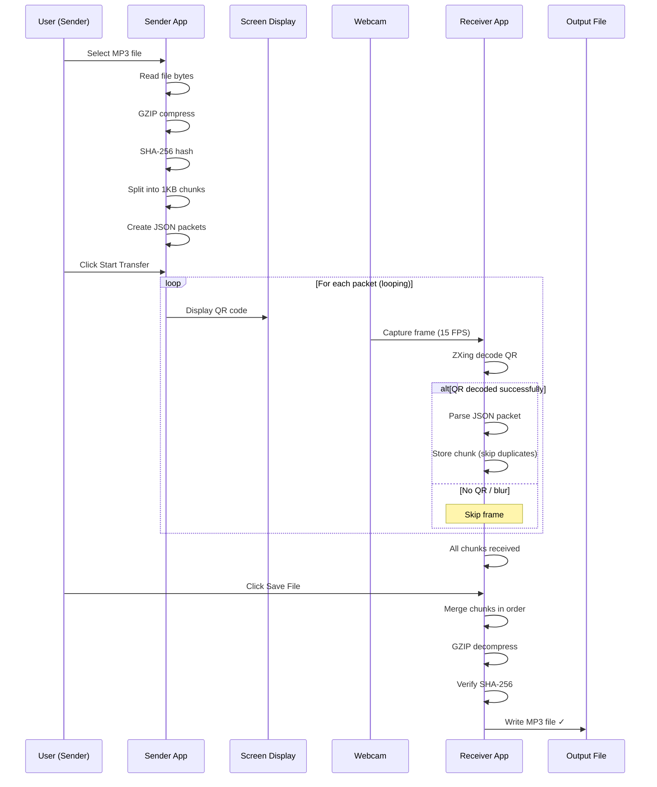

# Optical File Transfer

> Transfer files between two laptops using **QR codes displayed on screen** and **scanned by webcam**. No network, no Bluetooth, no WiFi — purely optical communication.

## 🎯 Overview

This application transfers MP3 files (and other files) between two laptops using an optical channel:

1. **Sender** (Laptop A): Reads a file, compresses it, splits it into chunks, and displays a sequence of QR codes on screen.
2. **Receiver** (Laptop B): Captures QR codes via webcam, decodes them, reassembles the chunks, decompresses, verifies integrity, and saves the file.

## 🏗️ Architecture

```mermaid
graph LR
    subgraph "Sender (Laptop A)"
        A[Select File] --> B[GZIP Compress]
        B --> C[SHA-256 Hash]
        C --> D[Split into 1KB Chunks]
        D --> E[Base64 Encode + JSON Wrap]
        E --> F[Generate QR Codes]
        F --> G[Display on Screen at 5 FPS]
    end

    G -.->|"Optical Channel<br>(Screen → Camera)"| H

    subgraph "Receiver (Laptop B)"
        H[Webcam Capture 15 FPS] --> I[ZXing Decode QR]
        I --> J[Parse JSON Packet]
        J --> K[Store Chunk]
        K --> L{All Chunks?}
        L -->|No| H
        L -->|Yes| M[Merge & Decompress]
        M --> N[Verify SHA-256]
        N --> O[Save File ✓]
    end
```



## 📋 Transfer Protocol

### Packet Types

| Type | Purpose | Key Fields |
|------|---------|------------|
| **HEADER** | File metadata | transferId, fileName, fileSize, totalChunks, hash |
| **CHUNK** | File data | transferId, sequence, totalChunks, payload (Base64) |
| **END** | Transfer complete | transferId, type="END" |

### Sequence

```
HEADER → CHUNK 1 → CHUNK 2 → ... → CHUNK N → END → HEADER → (loops)
```

The sender loops continuously so the receiver can recover missed frames.

## 🔧 Technology Stack

| Component | Technology | Version |
|-----------|-----------|---------|
| Language | Java | 21 |
| Desktop UI | JavaFX | 21.0.5 |
| QR Generation/Decoding | ZXing | 3.5.4 |
| Camera Access | OpenCV (org.openpnp) | 4.9.0-0 |
| JSON | Jackson | 2.17.2 |
| Compression | GZIP | JDK built-in |
| Hashing | SHA-256 | JDK built-in |
| Logging | SLF4J + Logback | 2.0.13 / 1.5.8 |
| Build | Maven | 3.9+ |

## 📁 Project Structure

```
optical-transfer/
├── pom.xml                    (Parent POM)
├── shared/                    (Shared models & utilities)
│   └── src/main/java/com/optical/shared/
│       ├── model/             TransferHeader, ChunkPacket, TransferEnd, PacketType
│       ├── protocol/          PacketSerializer
│       └── util/              HashUtil, CompressionUtil, ChunkUtil
├── sender/                    (Sender application)
│   └── src/main/java/com/optical/sender/
│       ├── SenderApp.java     JavaFX Application
│       ├── ui/                SenderController
│       ├── service/           TransferService
│       ├── qr/                QRCodeGenerator
│       ├── chunk/             FileChunker
│       └── util/              TransferConfig
├── receiver/                  (Receiver application)
│   └── src/main/java/com/optical/receiver/
│       ├── ReceiverApp.java   JavaFX Application
│       ├── ui/                ReceiverController
│       ├── service/           ReceptionService
│       ├── camera/            WebcamCapture
│       ├── decoder/           QRCodeDecoder
│       ├── assembler/         FileAssembler
│       └── util/              ReceiverConfig
└── README.md
```

## 🚀 Build & Run

### Prerequisites

- **JDK 21** or later
- **Maven 3.9+**
- **Webcam** (for receiver laptop)

### Build

```bash
cd optical-transfer
mvn clean package
```

### Run Sender (Laptop A)

```bash
mvn -pl sender javafx:run
```

### Run Receiver (Laptop B)

```bash
mvn -pl receiver javafx:run
```

### Run Tests

```bash
mvn clean test
```

## 📖 Usage Guide

### Sender

1. Launch the Sender application
2. Click **"Select MP3 File"** to choose a file
3. Adjust the speed slider (1–15 QR/sec, default 5)
4. Click **"Start Transfer"**
5. Position the sender's screen so the receiver's camera can see the QR codes
6. The sender loops continuously — leave it running until the receiver confirms completion

### Receiver

1. Launch the Receiver application
2. (Optional) Click **"Output Folder"** to choose where to save the file
3. Click **"Start Scanning"** to activate the webcam
4. Point the webcam at the sender's screen showing QR codes
5. Watch the progress bar as chunks are received
6. When all chunks are received, click **"Save File"** to assemble and save

## ⚡ Performance

| Metric | Target |
|--------|--------|
| Chunk size | 1000 bytes |
| QR display rate | 5 FPS (configurable) |
| Camera scan rate | 15 FPS |
| 1 MB file transfer | ~3–5 minutes |
| Success rate (1 MB) | >95% |

### Transfer Time Estimates

| File Size | Estimated Time (5 FPS) |
|-----------|----------------------|
| 100 KB | ~15–30 seconds |
| 500 KB | ~1–2 minutes |
| 1 MB | ~3–5 minutes |
| 5 MB | ~15–25 minutes |

## 🔍 Troubleshooting

### QR codes not scanning?
- Ensure good lighting conditions
- Reduce the distance between screen and camera
- Try lowering the QR display rate (e.g., 2–3 FPS)
- Clean the webcam lens

### Camera not opening?
- Ensure no other application is using the webcam
- Check webcam permissions in your OS settings
- Try a different camera index in `ReceiverConfig.java`

### Hash mismatch on assembly?
- Some chunks may have been decoded with errors
- Stop and restart both sender and receiver
- Try with a smaller file first to verify the setup

## 📐 Sequence Diagram



## 📜 License

This project is for educational and experimental purposes.
