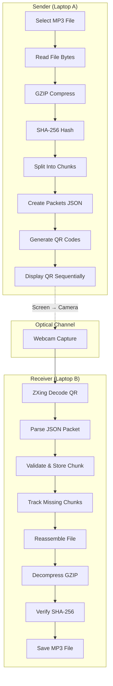

# Optical File Transfer — Implementation Plan

Transfer files between two laptops using QR codes displayed on screen and scanned via webcam. No network, Bluetooth, WiFi, or any other connectivity — purely optical.

## User Review Required

> [!IMPORTANT]
> **OpenCV Dependency Choice**: The plan uses `org.openpnp:opencv:4.9.0-0` for webcam access. This bundles native libraries automatically. An alternative is `javacv-platform:1.5.10` which is heavier but more actively maintained. Please confirm your preference.

> [!IMPORTANT]
> **Java Module System**: The plan uses a **non-modular** approach (no `module-info.java`) for simplicity. JavaFX will be launched via a separate `Launcher` class pattern to avoid classpath issues. Confirm this is acceptable.

> [!WARNING]
> **QR Capacity Constraint**: With 1000-byte chunks → Base64 (~1334 chars) + JSON metadata (~120 chars) ≈ **1454 characters** per QR code. QR Version 40 supports 2953 bytes in binary mode, so this fits comfortably. However, larger QR codes are harder for webcams to scan reliably. If transfer rates are too low, we may need to reduce chunk size.

## Open Questions

1. **Target JDK**: You specified Java 21. Should the project target exactly JDK 21 or be compatible with 21+?
2. **Receiver output directory**: Should the receiver save files to a user-selected directory, or a fixed `output/` folder?
3. **JavaFX version**: Plan uses JavaFX 21.0.5 (latest LTS). OK?

---

## Architecture Overview



## Proposed Changes

### Maven Multi-Module Structure

```
e:\javaProject\Optical communication\optical-transfer\
├── pom.xml                          (Parent POM)
├── shared\
│   ├── pom.xml
│   └── src\main\java\com\optical\shared\
│       ├── model\
│       │   ├── TransferHeader.java
│       │   ├── ChunkPacket.java
│       │   └── TransferEnd.java
│       ├── protocol\
│       │   └── PacketSerializer.java
│       └── util\
│           ├── HashUtil.java
│           ├── CompressionUtil.java
│           └── ChunkUtil.java
├── sender\
│   ├── pom.xml
│   └── src\main\java\com\optical\sender\
│       ├── SenderApp.java           (JavaFX Application)
│       ├── SenderLauncher.java      (Main entry point)
│       ├── ui\
│       │   └── SenderController.java
│       ├── service\
│       │   └── TransferService.java
│       ├── qr\
│       │   └── QRCodeGenerator.java
│       ├── chunk\
│       │   └── FileChunker.java
│       └── util\
│           └── TransferConfig.java
├── receiver\
│   ├── pom.xml
│   └── src\main\java\com\optical\receiver\
│       ├── ReceiverApp.java         (JavaFX Application)
│       ├── ReceiverLauncher.java    (Main entry point)
│       ├── ui\
│       │   └── ReceiverController.java
│       ├── service\
│       │   └── ReceptionService.java
│       ├── camera\
│       │   └── WebcamCapture.java
│       ├── decoder\
│       │   └── QRCodeDecoder.java
│       ├── assembler\
│       │   └── FileAssembler.java
│       └── util\
│           └── ReceiverConfig.java
└── README.md
```

---

### Component 1: Shared Module

Core data models, serialization, and utilities shared by both applications.

#### [NEW] [pom.xml](file:///e:/javaProject/Optical%20communication/optical-transfer/shared/pom.xml)
- Dependencies: Jackson (databind), SLF4J API
- Packaging: jar

#### [NEW] [TransferHeader.java](file:///e:/javaProject/Optical%20communication/optical-transfer/shared/src/main/java/com/optical/shared/model/TransferHeader.java)
- Fields: `transferId` (UUID), `fileName`, `fileSize`, `totalChunks`, `hash` (SHA-256)
- Jackson annotations for JSON serialization
- Immutable record-style class

#### [NEW] [ChunkPacket.java](file:///e:/javaProject/Optical%20communication/optical-transfer/shared/src/main/java/com/optical/shared/model/ChunkPacket.java)
- Fields: `transferId`, `sequence`, `totalChunks`, `payload` (Base64 string)
- Jackson annotations

#### [NEW] [TransferEnd.java](file:///e:/javaProject/Optical%20communication/optical-transfer/shared/src/main/java/com/optical/shared/model/TransferEnd.java)
- Fields: `transferId`, `type` ("END")

#### [NEW] [PacketSerializer.java](file:///e:/javaProject/Optical%20communication/optical-transfer/shared/src/main/java/com/optical/shared/protocol/PacketSerializer.java)
- `serialize(Object packet) → String` (JSON)
- `deserializeHeader(String json) → TransferHeader`
- `deserializeChunk(String json) → ChunkPacket`
- `deserializeEnd(String json) → TransferEnd`
- `detectPacketType(String json) → PacketType` enum (HEADER, CHUNK, END)
- Uses Jackson `ObjectMapper` (configured, reusable instance)

#### [NEW] [HashUtil.java](file:///e:/javaProject/Optical%20communication/optical-transfer/shared/src/main/java/com/optical/shared/util/HashUtil.java)
- `sha256(byte[] data) → String` (hex-encoded)
- Uses `java.security.MessageDigest`

#### [NEW] [CompressionUtil.java](file:///e:/javaProject/Optical%20communication/optical-transfer/shared/src/main/java/com/optical/shared/util/CompressionUtil.java)
- `compress(byte[] data) → byte[]` using `GZIPOutputStream`
- `decompress(byte[] data) → byte[]` using `GZIPInputStream`

#### [NEW] [ChunkUtil.java](file:///e:/javaProject/Optical%20communication/optical-transfer/shared/src/main/java/com/optical/shared/util/ChunkUtil.java)
- `splitIntoChunks(byte[] data, int chunkSize) → List<byte[]>`
- `mergeChunks(Map<Integer, byte[]> chunks, int totalChunks) → byte[]`
- Validates all chunks present before merge

---

### Component 2: Sender Module

JavaFX application that reads a file, chunks it, generates QR codes, and displays them sequentially.

#### [NEW] [pom.xml](file:///e:/javaProject/Optical%20communication/optical-transfer/sender/pom.xml)
- Dependencies: shared module, JavaFX (controls, fxml, swing), ZXing (core, javase), Jackson, SLF4J + Logback
- Plugin: `javafx-maven-plugin` for running

#### [NEW] [SenderLauncher.java](file:///e:/javaProject/Optical%20communication/optical-transfer/sender/src/main/java/com/optical/sender/SenderLauncher.java)
- Standard `main()` method that calls `Application.launch(SenderApp.class)`
- Workaround for JavaFX classpath issues in non-modular projects

#### [NEW] [SenderApp.java](file:///e:/javaProject/Optical%20communication/optical-transfer/sender/src/main/java/com/optical/sender/SenderApp.java)
- Extends `javafx.application.Application`
- Loads FXML or builds UI programmatically
- Window title: "Optical File Transfer — Sender"
- Minimum size: 900×800

#### [NEW] [SenderController.java](file:///e:/javaProject/Optical%20communication/optical-transfer/sender/src/main/java/com/optical/sender/ui/SenderController.java)
- **UI Components**:
  - File picker button + file path label
  - "Start Transfer" button (disabled until file selected)
  - 700×700 `ImageView` for QR display
  - `ProgressBar` (chunk progress)
  - Labels: current chunk / total chunks, estimated time, transfer status
  - Speed slider (1-15 QR/sec, default 5)
  - "Pause" / "Resume" / "Stop" buttons
- **Logic**:
  - On file select → show file name, size
  - On start → kick off `TransferService` on background thread
  - `AnimationTimer` or `Timeline` drives QR frame display at configured FPS
  - Updates progress on JavaFX Application Thread via `Platform.runLater()`

#### [NEW] [TransferService.java](file:///e:/javaProject/Optical%20communication/optical-transfer/sender/src/main/java/com/optical/sender/service/TransferService.java)
- `prepareTransfer(File file) → TransferSession`
  1. Read file bytes
  2. GZIP compress
  3. SHA-256 hash of original bytes
  4. Split compressed bytes into 1000-byte chunks
  5. Create `TransferHeader` packet
  6. Create `ChunkPacket` for each chunk (Base64 encode payload)
  7. Create `TransferEnd` packet
  8. Return session with ordered list of all packets
- `getPacketAtIndex(int index) → String` (JSON)
- Looping behavior: after displaying END, loop back to HEADER for retransmission

#### [NEW] [QRCodeGenerator.java](file:///e:/javaProject/Optical%20communication/optical-transfer/sender/src/main/java/com/optical/sender/qr/QRCodeGenerator.java)
- `generateQRImage(String data, int width, int height) → BufferedImage`
- Uses ZXing `MultiFormatWriter` with `BarcodeFormat.QR_CODE`
- Error correction level: `ErrorCorrectionLevel.M` (15% recovery, good balance)
- Converts `BitMatrix` → `BufferedImage` via `MatrixToImageWriter`
- Caches recently generated QR images for performance

#### [NEW] [FileChunker.java](file:///e:/javaProject/Optical%20communication/optical-transfer/sender/src/main/java/com/optical/sender/chunk/FileChunker.java)
- Delegates to `ChunkUtil.splitIntoChunks()`
- Creates `ChunkPacket` objects with sequence numbers (1-indexed)
- Base64-encodes each chunk's payload

#### [NEW] [TransferConfig.java](file:///e:/javaProject/Optical%20communication/optical-transfer/sender/src/main/java/com/optical/sender/util/TransferConfig.java)
- Constants: `CHUNK_SIZE = 1000`, `DEFAULT_FPS = 5`, `QR_SIZE = 700`
- Configurable via UI controls

#### [NEW] [sender.fxml](file:///e:/javaProject/Optical%20communication/optical-transfer/sender/src/main/resources/fxml/sender.fxml)
- FXML layout for the sender UI

#### [NEW] [sender-styles.css](file:///e:/javaProject/Optical%20communication/optical-transfer/sender/src/main/resources/css/sender-styles.css)
- Dark theme styling for the sender application

#### [NEW] [logback.xml](file:///e:/javaProject/Optical%20communication/optical-transfer/sender/src/main/resources/logback.xml)
- Console + file appender, pattern with timestamps

---

### Component 3: Receiver Module

JavaFX application that captures webcam frames, decodes QR codes, and reassembles the file.

#### [NEW] [pom.xml](file:///e:/javaProject/Optical%20communication/optical-transfer/receiver/pom.xml)
- Dependencies: shared module, JavaFX (controls, fxml, swing), ZXing (core, javase), OpenCV (`org.openpnp:opencv:4.9.0-0`), Jackson, SLF4J + Logback

#### [NEW] [ReceiverLauncher.java](file:///e:/javaProject/Optical%20communication/optical-transfer/receiver/src/main/java/com/optical/receiver/ReceiverLauncher.java)
- Main entry point, loads OpenCV native lib via `nu.pattern.OpenCV.loadShared()`
- Calls `Application.launch(ReceiverApp.class)`

#### [NEW] [ReceiverApp.java](file:///e:/javaProject/Optical%20communication/optical-transfer/receiver/src/main/java/com/optical/receiver/ReceiverApp.java)
- JavaFX Application
- Window title: "Optical File Transfer — Receiver"
- On close: releases camera resources

#### [NEW] [ReceiverController.java](file:///e:/javaProject/Optical%20communication/optical-transfer/receiver/src/main/java/com/optical/receiver/ui/ReceiverController.java)
- **UI Components**:
  - 640×480 `ImageView` for webcam preview
  - "Start Scanning" / "Stop" buttons
  - Labels: transfer ID, file name, detected chunks, missing chunks, total chunks
  - `ProgressBar` (received / total)
  - Transfer status label (Waiting / Receiving / Complete / Error)
  - Output file path selector
  - "Save File" button (enabled on completion)
- **Logic**:
  - Starts `WebcamCapture` on background thread
  - Each frame → decode → update chunk storage → update UI
  - On all chunks received → auto-trigger assembly

#### [NEW] [ReceptionService.java](file:///e:/javaProject/Optical%20communication/optical-transfer/receiver/src/main/java/com/optical/receiver/service/ReceptionService.java)
- Manages the reception state machine:
  - `IDLE` → `RECEIVING_HEADER` → `RECEIVING_CHUNKS` → `COMPLETE` / `ERROR`
- `processPacket(String json)`:
  - Detects packet type
  - On HEADER: initializes session (stores metadata, prepares chunk map)
  - On CHUNK: validates transferId, stores in `ConcurrentHashMap<Integer, byte[]>`, ignores duplicates
  - On END: triggers assembly if all chunks received
- Thread-safe (camera thread writes, UI thread reads)

#### [NEW] [WebcamCapture.java](file:///e:/javaProject/Optical%20communication/optical-transfer/receiver/src/main/java/com/optical/receiver/camera/WebcamCapture.java)
- Uses OpenCV `VideoCapture(0)` to open default webcam
- Runs capture loop on dedicated daemon thread
- `grabFrame() → Mat`
- Converts `Mat` → `BufferedImage` for ZXing processing
- Converts `Mat` → JavaFX `Image` for preview display
- Target: 15 FPS capture rate
- Clean shutdown with `release()`

#### [NEW] [QRCodeDecoder.java](file:///e:/javaProject/Optical%20communication/optical-transfer/receiver/src/main/java/com/optical/receiver/decoder/QRCodeDecoder.java)
- `decode(BufferedImage image) → Optional<String>`
- Uses ZXing `MultiFormatReader` with `DecodeHintType.TRY_HARDER`
- Converts `BufferedImage` → `BinaryBitmap` → `LuminanceSource` → `HybridBinarizer`
- Returns `Optional.empty()` on decode failure (blur, no QR, etc.)
- Logs decode failures at DEBUG level

#### [NEW] [FileAssembler.java](file:///e:/javaProject/Optical%20communication/optical-transfer/receiver/src/main/java/com/optical/receiver/assembler/FileAssembler.java)
- `assemble(Map<Integer, byte[]> chunks, int totalChunks, String expectedHash, String fileName) → File`
  1. Validates all chunks present (1..totalChunks)
  2. Sort by sequence → merge into single byte array
  3. Decompress GZIP
  4. Compute SHA-256 of decompressed data
  5. Compare with expected hash
  6. If match → write to output file, return path
  7. If mismatch → throw `HashMismatchException`

#### [NEW] [ReceiverConfig.java](file:///e:/javaProject/Optical%20communication/optical-transfer/receiver/src/main/java/com/optical/receiver/util/ReceiverConfig.java)
- Constants: `CAMERA_INDEX = 0`, `SCAN_FPS = 15`, `OUTPUT_DIR = "received_files"`

#### [NEW] [receiver.fxml](file:///e:/javaProject/Optical%20communication/optical-transfer/receiver/src/main/resources/fxml/receiver.fxml)
- FXML layout for the receiver UI

#### [NEW] [receiver-styles.css](file:///e:/javaProject/Optical%20communication/optical-transfer/receiver/src/main/resources/css/receiver-styles.css)
- Dark theme styling for the receiver application

#### [NEW] [logback.xml](file:///e:/javaProject/Optical%20communication/optical-transfer/receiver/src/main/resources/logback.xml)
- Console + file appender

---

### Component 4: Tests

#### [NEW] Shared Module Tests
- `ChunkUtilTest.java` — split/merge roundtrip, edge cases
- `PacketSerializerTest.java` — serialize/deserialize all packet types
- `HashUtilTest.java` — known hash verification
- `CompressionUtilTest.java` — compress/decompress roundtrip

#### [NEW] Sender Module Tests
- `FileChunkerTest.java` — chunking with various file sizes
- `QRCodeGeneratorTest.java` — generates valid QR images
- `TransferServiceTest.java` — end-to-end packet generation

#### [NEW] Receiver Module Tests
- `QRCodeDecoderTest.java` — decodes QR images generated by sender
- `FileAssemblerTest.java` — reassembly, hash verification, missing chunk detection
- `ReceptionServiceTest.java` — packet processing state machine

#### [NEW] Integration Tests
- `TransferIntegrationTest.java` — full pipeline: file → compress → chunk → serialize → deserialize → reassemble → decompress → verify hash

---

### Component 5: Documentation

#### [NEW] [README.md](file:///e:/javaProject/Optical%20communication/optical-transfer/README.md)
- Project overview, architecture, build instructions, run instructions
- Architecture diagram (Mermaid)
- Sequence diagram (Mermaid)
- Configuration guide
- Troubleshooting

---

## Dependency Versions

| Dependency | Group ID | Artifact ID | Version |
|---|---|---|---|
| JavaFX Controls | org.openjfx | javafx-controls | 21.0.5 |
| JavaFX FXML | org.openjfx | javafx-fxml | 21.0.5 |
| JavaFX Swing | org.openjfx | javafx-swing | 21.0.5 |
| ZXing Core | com.google.zxing | core | 3.5.4 |
| ZXing JavaSE | com.google.zxing | javase | 3.5.4 |
| OpenCV | org.openpnp | opencv | 4.9.0-0 |
| Jackson Databind | com.fasterxml.jackson.core | jackson-databind | 2.17.2 |
| SLF4J API | org.slf4j | slf4j-api | 2.0.13 |
| Logback Classic | ch.qos.logback | logback-classic | 1.5.8 |
| JUnit 5 | org.junit.jupiter | junit-jupiter | 5.10.3 |

## Transfer Protocol Details

### Packet Sequence

```
[HEADER] → [CHUNK 1] → [CHUNK 2] → ... → [CHUNK N] → [END] → [HEADER] → (repeat)
```

The sender **loops** the entire sequence continuously so the receiver can:
- Join mid-transfer and still get the header
- Pick up any chunks it missed
- Handle camera lag and blur gracefully

### QR Data Format
Each QR code contains a JSON string. The packet type is detected by checking for the presence of specific fields:
- Has `"totalChunks"` + `"hash"` → HEADER
- Has `"payload"` → CHUNK  
- Has `"type":"END"` → END

### Chunk Sizing Math
For a 1 MB MP3 file:
- Original: 1,048,576 bytes
- After GZIP (~60% compression for MP3): ~629,146 bytes (MP3 is already compressed, so ~40% reduction realistically)
- Chunks at 1000 bytes: ~630 chunks
- At 5 QR/sec: ~126 seconds (2.1 minutes)
- With missed frames and retransmission loops: ~3-5 minutes estimated

## Verification Plan

### Automated Tests
```bash
cd e:\javaProject\Optical communication\optical-transfer
mvn clean test
```

Tests will verify:
- Chunking: split + merge roundtrip for various sizes
- Serialization: all packet types serialize/deserialize correctly
- Hashing: SHA-256 produces expected output
- Compression: GZIP compress/decompress roundtrip preserves data
- Integration: full file → QR data → reconstruction pipeline
- QR: generated QR codes are decodable by ZXing

### Manual Verification
1. Build both applications: `mvn clean package`
2. Run sender on Laptop A: `mvn -pl sender javafx:run`
3. Run receiver on Laptop B: `mvn -pl receiver javafx:run`
4. Select an MP3 file on sender, start transfer
5. Position Laptop B's camera at Laptop A's screen
6. Verify receiver shows progress, completes, and saves valid MP3
7. Play the received MP3 file to confirm integrity

### Build Verification
```bash
mvn clean compile    # Compiles all modules
mvn clean test       # Runs all unit tests
mvn clean package    # Creates executable JARs
```
